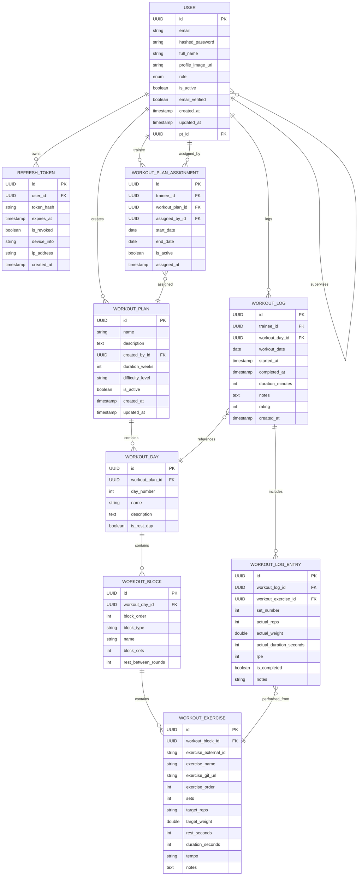

# Entity-Relationship Diagram

Notes:
- `role` enumerates ADMIN, PT, TRAINEE; `pt_id` on USER links a trainee to their personal trainer (self-join via `supervises`).
- `exercise_external_id` points to ExerciseDB records; names/GIF URLs are cached for speed.

## Entity details
- **Users**: Single-table inheritance via discriminator `role`. Base fields for auth/profile; `pt_id` ties a trainee to a personal trainer (PT sees trainees list).
- **RefreshToken**: Hashed refresh token per user with expiry/revocation plus device/IP metadata.
- **WorkoutPlan**: Authored by a user (PT/Admin); name, description, duration/difficulty, active flag; owns ordered WorkoutDays and assignments.
- **WorkoutDay**: Part of a plan; day number, optional name/description, rest flag; owns ordered WorkoutBlocks.
- **WorkoutBlock**: Part of a day; block order/type (NORMAL/SUPERSET/etc.), optional name, block sets/rest; owns ordered WorkoutExercises.
- **WorkoutExercise**: Part of a block; references ExerciseDB by `exercise_external_id` with cached name/GIF; order plus prescription fields (sets/reps/weight/rest/duration/tempo/notes).
- **WorkoutPlanAssignment**: Junction linking trainee to plan with assigning user, start/end dates, active flag; unique on trainee+plan.
- **WorkoutLog**: A trainee session for a given WorkoutDay/date; tracks start/end, duration, notes, rating; owns entries.
- **WorkoutLogEntry**: Set-level actuals tied to a WorkoutLog and prescribed WorkoutExercise; records set number, reps/weight/duration, RPE, completion, notes.
